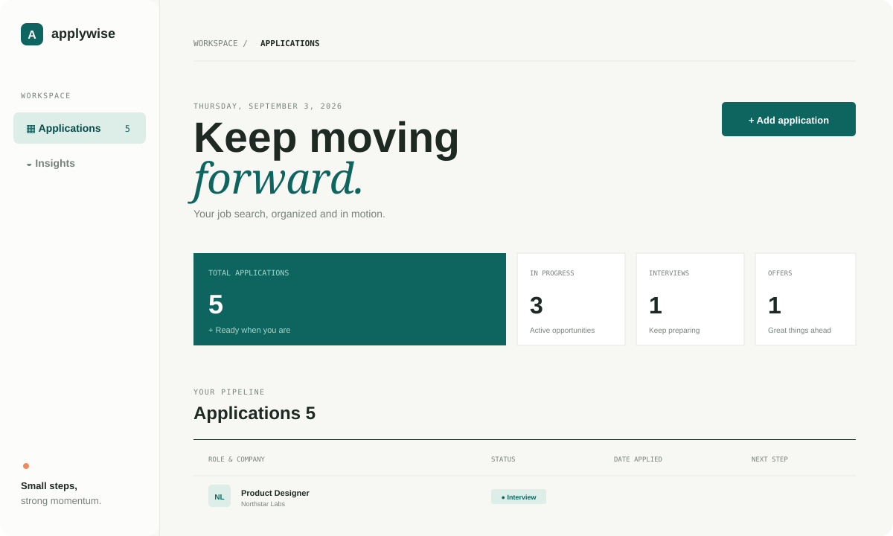

# Applywise

Applywise is a focused job application tracker built with HTML, CSS, and vanilla JavaScript. It helps you keep your search organized, visible, and moving forward.



## Features

- Add applications with company, role, status, date, and next step
- Track salary, job URL, interview date, and free-form notes per application
- Search roles, companies, and notes
- Filter applications by status
- Sort by date, company, or status
- View pipeline totals for applications, active opportunities, interviews, and offers
- Delete applications
- Export applications to JSON and import them back (works across devices)
- Persist data in the browser with `localStorage`
- Responsive layout for desktop and mobile screens
- Sign-up with full name and sign-out support
- Forgotten-password recovery
- Editable user profile with name, job title, location, and bio
- Change password from the signed-in profile
- Local accounts store only salted SHA-256 password hashes (never plaintext)

## Optional Cloud Storage and Login

Applywise works locally by default. To enable accounts and cloud storage with Supabase:

1. Create a free project at [supabase.com](https://supabase.com).
2. Open the Supabase SQL Editor and run the contents of `supabase-schema.sql`.
3. Open **Project Settings > API** in Supabase.
4. Copy your project URL and public anon key into `supabase-config.js`:

    ```javascript
    window.APPLYWISE_SUPABASE = {
       url: "https://your-project.supabase.co",
       anonKey: "your-public-anon-key"
    };
    ```

5. Open `index.html` and create an account.

For password-reset links to work, add the URL where Applywise runs to **Authentication > URL Configuration > Redirect URLs** in Supabase. For Live Server this is usually `http://127.0.0.1:5500/Applywise/index.html`; use your real deployed website URL when the app is hosted online.

After setup, each user sees only their own applications. The database policies in `supabase-schema.sql` provide that separation. Use only the public anon key in the browser; never add a Supabase service-role key to this project.

### Local testing before Supabase setup

If the Supabase placeholders are still in `supabase-config.js`, Applywise shows a local sign-up and sign-in screen so you can test the interface immediately. Local accounts and passwords are stored in that browser only and are not suitable for production. Configure Supabase before sharing the application with real users.

### Export and import

Use **Export** in the toolbar to download all applications as a JSON file. Use **Import** to load them back — useful for backups or moving data between browsers and devices. In cloud mode, imported rows are inserted into Supabase; in local mode they are merged into `localStorage`. Invalid rows are skipped and a summary is shown.

### Local password security

Local (non-Supabase) accounts never store plaintext passwords. Each account holds a random 16-byte salt and a SHA-256 hash computed with the Web Crypto API. Accounts created before this change are upgraded automatically the next time you sign in. For production use, prefer the Supabase mode, where authentication and password storage are handled server-side with bcrypt.

During sign-up, the user's full name is saved and shown in the dashboard profile area. The **Log out** button returns the user to the sign-in screen.

New accounts start with an empty application list. The sample applications are used only when testing the app before an account is created.

The **Forgot password?** link starts password recovery. With Supabase configured, the user receives a secure email reset link. In local testing mode, the account can be reset on the same device; this fallback is for testing only.

After signing in, users can select their profile avatar to add or update their full name, job title, location, and short bio. Profile details are stored with the account in Supabase or per-account in local testing mode.

The profile's **Security** section also allows authenticated users to change their password. Local testing mode checks the current password; Supabase mode updates the authenticated account securely.

## How It Works

### For users

1. Click **Add application**.
2. Enter the company, role, application date, status, and next step.
3. Save the application to add it to the tracker.
4. Use search, filters, and sorting to find and organize applications.
5. Delete an application when it is no longer needed.

For example, after applying for a Junior Frontend Developer role at ABC Technologies, you can save the application with an `Applied` status and a reminder to follow up next week. If the company invites you to an interview, you can add the updated application details and status.

### For developers

- `index.html` creates the dashboard, statistics cards, application table, filters, and add-application form.
- `styles.css` controls the colors, layout, status badges, responsive design, and mobile view.
- `script.js` manages application data, search, filters, sorting, adding, deleting, and statistics.
- The browser's `localStorage` saves applications on the user's device, so no account, server, or database is required.

When an application is added or deleted, JavaScript updates the data, saves it to `localStorage`, and re-renders the dashboard so the table and totals stay current.

## Getting Started

1. Clone the repository:

   ```bash
   git clone https://github.com/WillyDev029/Applywise.git
   ```

2. Open the project folder.
3. Open `index.html` in a browser.

No build tools or dependencies are required.

## Project Structure

```text
Applywise/
├── index.html
├── script.js
├── styles.css
├── supabase-config.js
├── supabase-schema.sql
├── assets/
│   └── applywise-preview.svg
└── README.md
```

## Data Storage

Applications are saved in your browser's local storage. Clearing site data or switching browsers will remove the saved applications for that browser.

## License

This project is available for personal and educational use.
